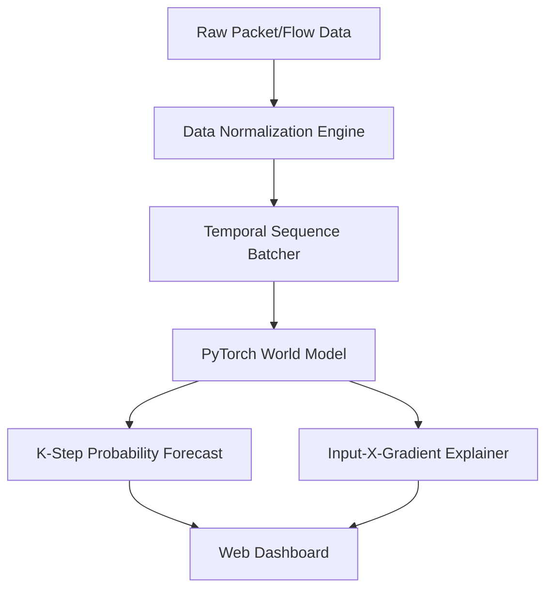

# VIGHNAX


**VIGHNAX's Bhavi?yAdvakta** is an advanced AI-based Network Attack Forecaster using state-of-the-art Temporal World Models. It learns the "physics" of network behavior to forecast multi-step attack infiltrations (Zero-Day threats) entirely offline without external API dependencies.

## ?? Key Features

* **Cyber World Model (Temporal Forecasting):** Predicts the next $K$ steps of adversary behavior using a PyTorch sequence autoencoder, allowing early interception of lateral movement before impact.
* **Zero-Day Feature Explanations:** Uses pure PyTorch `Input-X-Gradient` attribution to identify exactly which packet features (e.g., `byte_count`, `flag_ack`) are driving the anomalous forecast.
* **Threat Intel Enrichment:** Automatically parses unstructured threat clusters into structured MITRE ATT&CK codes (e.g., `T1071`) and CAPEC matrices.
* **Live Telemetry Dashboard:** A glassmorphic, hyper-responsive Flask web dashboard for real-time visualization of infiltration probabilities and baseline comparisons.

## ??? Architecture



## ?? Setup Guide

### 1. Requirements
Ensure you have Python 3.10+ installed on your system.

### 2. Installation
Clone the repository and install the required dependencies:
```bash
git clone https://github.com/your-username/VIGHNAX.git
cd VIGHNAX
pip install -r requirements.txt
```

### 3. Running the Live Dashboard
To start the local web interface and simulate the streaming temporal model:
```bash
python server.py
```
Open your browser and navigate to `http://127.0.0.1:5000`.

### 4. Enterprise Training
To run full-scale mathematical convergence verification and train the models on local datasets (CICIoT2023, LANL, DARPA):
```bash
python train_enterprise.py
```

## ?? Repository Structure

* `data/` - Contains mock CSV extracts for immediate local testing without 100GB datasets.
* `src/` - The core AI engine.
  * `models/` - PyTorch World Model and Logistic Regression baselines.
  * `evaluation/` - Input-X-Gradient Explainer algorithms.
  * `data/` - Telemetry aligners, Mitre mappers, and dataset loaders.
* `static/` & `templates/` - Vanilla JS/CSS frontend powered by Chart.js.

